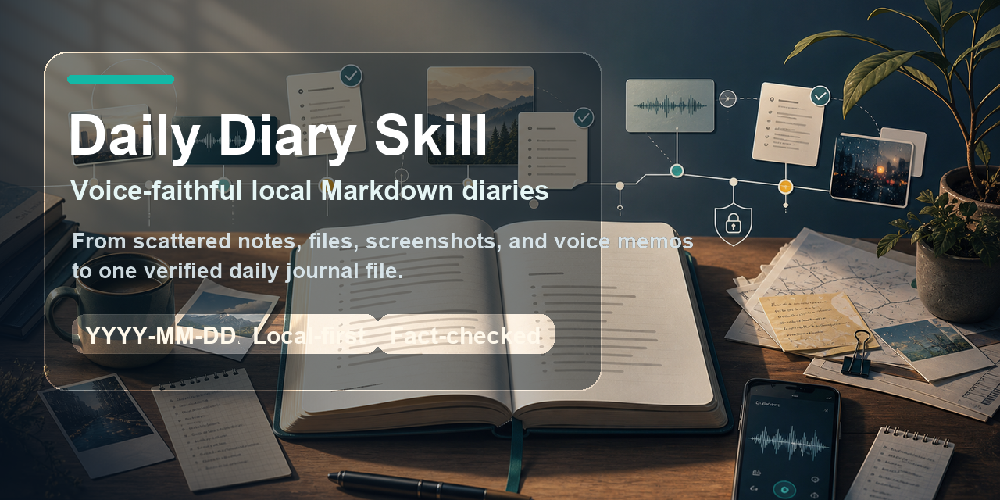
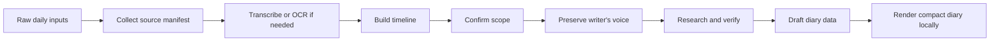

<p align="center">
  
</p>

<h1 align="center">Daily Diary Skill</h1>

<p align="center">
  Voice-faithful local Markdown diaries from scattered notes, files, screenshots, and voice memories.
</p>

<p align="center">
  
  
  
</p>

## What It Does

Daily Diary is a Codex skill for creating a local diary file from messy daily inputs.

It accepts material such as text dumps, local files, folders, screenshots, audio/video notes, chat exports, PDFs, documents, and mixed fragments. It helps Codex collect those sources, arrange them into a chronological timeline, verify uncertain facts, enrich the day with date and weather context, and save the final diary as a local Markdown file.

The writer's voice is the source of truth. The skill must not sanitize, balance, moralize, or replace the writer's thoughts, wording, biases, emotions, or point of view. It only organizes the diary and checks objective facts.

The output is intentionally simple:

```text
20260603周日晴

Diary body...
```

The file itself is still named:

```text
YYYY-MM-DD.md
```

No GitHub publishing for diary entries. No diary cover image. No generated diary asset bundle. Just one local `.md` diary file for the day.

## Defaults

| Setting | Default |
| --- | --- |
| Output format | Markdown |
| First line | `YYYYMMDD周X天气`, for example `20260603周日晴` |
| File name | `YYYY-MM-DD.md`, for example `2026-06-03.md` |
| Output location | `./diary` unless the user chooses another local folder |
| Primary language | English |
| Additional languages | Optional, confirmed before writing |
| Default length | About 300-400 characters/words |
| Large input limit | Usually 800-1000 characters/words unless the user asks to keep everything |
| Paragraphs | Usually 3-4 |
| Fact checking | Weather, current events, names, places, and uncertain claims |
| Voice fidelity | Preserve the writer's original thoughts, wording, biases, and emotions |
| Publishing | None |
| Diary cover image | None |

## Workflow



Before writing the diary, the skill confirms:

- target date
- timezone
- output language or languages
- weather location
- source scope
- uncertain claims to verify
- local output path
- target length and whether large inputs should be compressed

While writing, the skill preserves:

- the writer's stated beliefs and opinions
- hedges like "I think", "maybe", "好像", and "不确定"
- emotional tone, bias, contradiction, and uncertainty
- first-person perspective when present in the source

## Example Prompts

```text
Use $daily-diary to turn today's notes into an English diary and save it locally.
```

```text
Use $daily-diary on ~/Downloads/today-notes for 2026-06-09. Save the Markdown file in ~/Documents/diary.
```

```text
Use $daily-diary to process these voice notes and screenshots. Default to English, but add Chinese after I confirm the timeline.
```

## Example Output

```markdown
20260609周二阴

The day arrived in fragments, but by the end it had a shape. In the morning I kept circling around the same thought, half certain and half doubtful, trying to remember whether the detail I had in mind was actually true.

By afternoon, the scattered notes started to line up. The useful part was not that everything became neat, but that the order of the day became visible. I could see what I had cared about, what I had misunderstood, and what still felt unresolved.

At night I kept the diary short. I did not want to turn the day into a report. I only wanted to keep the texture of it: the uncertainty, the weather, the small decisions, and the way my own bias shaped what I noticed.

## Verification Notes

- **corrected** "I thought the meeting was with the Series B founder": the checked sources show the company had announced a Series A, not a Series B. The diary keeps the original belief because it shaped the day.
```

## Included Tools

| Script | Purpose |
| --- | --- |
| `scripts/collect_inputs.py` | Scan files and folders, extract text where possible, and build a JSONL manifest. |
| `scripts/render_diary.py` | Render `diary_data.json` into a compact local `YYYY-MM-DD.md` file. |

## Repository Layout

```text
daily-diary/
  assets/
    github-cover.png
  SKILL.md
  agents/openai.yaml
  references/
    output-schema.md
    research-checklist.md
    writing-fidelity.md
  scripts/
    collect_inputs.py
    render_diary.py
```

## Local Usage

Collect source files:

```bash
python ~/.codex/skills/daily-diary/scripts/collect_inputs.py \
  --date 2026-06-09 \
  --out .daily-diary-work/2026-06-09/manifest.jsonl \
  ~/Downloads/today-notes
```

Render the final diary:

```bash
python ~/.codex/skills/daily-diary/scripts/render_diary.py \
  --data .daily-diary-work/2026-06-09/diary_data.json \
  --dir ~/Documents/diary
```

This writes:

```text
~/Documents/diary/2026-06-09.md
```

## Privacy Model

Daily Diary is local-first:

- Original source files are never mutated.
- The final output is a local Markdown file.
- The skill does not publish, commit, push, or sync diary entries.
- The user chooses the local output folder.
- Private names, locations, screenshots, and sensitive notes can be anonymized before writing.
- Subjective thoughts and biases are preserved unless the user explicitly asks to anonymize or soften them.

## License

MIT. See [LICENSE](LICENSE).
