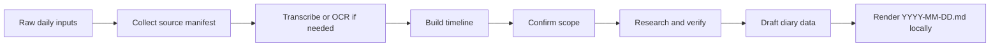

<h1 align="center">Daily Diary Skill</h1>

<p align="center">
  Turn scattered daily notes, files, screenshots, and voice memories into one verified local Markdown diary.
</p>

<p align="center">
  
  
  
</p>

## What It Does

Daily Diary is a Codex skill for creating a local diary file from messy daily inputs.

It accepts material such as text dumps, local files, folders, screenshots, audio/video notes, chat exports, PDFs, documents, and mixed fragments. It helps Codex collect those sources, arrange them into a chronological timeline, verify uncertain facts, enrich the day with date and weather context, and save the final diary as a local Markdown file.

The output is intentionally simple:

```text
YYYY-MM-DD.md
```

No GitHub publishing. No cover image. No generated asset bundle. Just one local `.md` diary file for the day.

## Defaults

| Setting | Default |
| --- | --- |
| Output format | Markdown |
| File name | `YYYY-MM-DD.md` |
| Output location | `./diary` unless the user chooses another local folder |
| Primary language | English |
| Additional languages | Optional, confirmed before writing |
| Fact checking | Weather, current events, names, places, and uncertain claims |
| Publishing | None |
| Cover image | None |

## Workflow



Before writing the diary, the skill confirms:

- target date
- timezone
- output language or languages
- weather location
- source scope
- uncertain claims to verify
- local output path

## Example Prompts

```text
Use $daily-diary to turn today's notes into an English diary and save it locally.
```

```text
Use $daily-diary on ~/Downloads/today-notes for 2026-06-09. Save the Markdown file in ~/Documents/diary.
```

```text
Use $daily-diary to process these voice notes and screenshots. Default to English, but add Chinese after I confirm the timeline.
```

## Example Output

```markdown
---
title: "A Day Gathered"
date: "2026-06-09"
location: "Shanghai"
weather: "Cloudy"
tags: ["journal", "learning"]
---

# A Day Gathered

Date: 2026-06-09
Location: Shanghai
Weather: Cloudy

## Source Summary

- 3 voice notes
- 2 screenshots
- 1 text note

## Timeline

- **09:00** Morning note: Recorded a thought that needed checking.
- **19:30** Evening walk: Noted the weather and mood.

## English Diary

The day arrived in fragments, but by the end it had a shape...

## Verification Notes

- **verified** Weather: Checked the target date and location.
```

## Included Tools

| Script | Purpose |
| --- | --- |
| `scripts/collect_inputs.py` | Scan files and folders, extract text where possible, and build a JSONL manifest. |
| `scripts/render_diary.py` | Render `diary_data.json` into a local `YYYY-MM-DD.md` file. |

## Repository Layout

```text
daily-diary/
  SKILL.md
  agents/openai.yaml
  references/
    output-schema.md
    research-checklist.md
  scripts/
    collect_inputs.py
    render_diary.py
```

## Local Usage

Collect source files:

```bash
python ~/.codex/skills/daily-diary/scripts/collect_inputs.py \
  --date 2026-06-09 \
  --out .daily-diary-work/2026-06-09/manifest.jsonl \
  ~/Downloads/today-notes
```

Render the final diary:

```bash
python ~/.codex/skills/daily-diary/scripts/render_diary.py \
  --data .daily-diary-work/2026-06-09/diary_data.json \
  --dir ~/Documents/diary
```

This writes:

```text
~/Documents/diary/2026-06-09.md
```

## Privacy Model

Daily Diary is local-first:

- Original source files are never mutated.
- The final output is a local Markdown file.
- The skill does not publish, commit, push, or sync diary entries.
- The user chooses the local output folder.
- Private names, locations, screenshots, and sensitive notes can be anonymized before writing.

## License

MIT. See [LICENSE](LICENSE).
