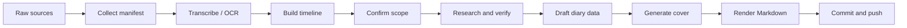

<p align="center">
  
</p>

<h1 align="center">Daily Diary Skill</h1>

<p align="center">
  Turn scattered notes, files, screenshots, and voice memories into a verified, beautifully structured daily diary.
</p>

<p align="center">
  <a href="https://github.com/BlackTreeBoom/daily-diary-skill"></a>
  
  
</p>

## What It Is

Daily Diary is a Codex skill for turning raw daily inputs into a polished personal diary entry. It accepts messy material: text dumps, local files, folders, screenshots, audio/video notes, chat exports, PDFs, documents, and mixed fragments. It then helps an agent collect the sources, arrange them chronologically, verify uncertain claims, enrich the entry with date and weather context, generate a cover, and publish the final Markdown entry to GitHub.

The default diary language is English. Additional languages, such as Chinese, can be selected before writing.

## Why It Exists

Most diary tools ask you to start from a blank page. Real days rarely arrive that cleanly. They arrive as voice notes, half-finished thoughts, screenshots, meeting fragments, calendar memories, and uncertain claims like "I think this happened today."

This skill is built for that mess.

It gives Codex a repeatable workflow for turning a day's raw material into a diary that feels human, stays factual, and is easy to keep in a GitHub-backed archive.

## Highlights

| Capability | What it does |
| --- | --- |
| Source collection | Scans files and folders, extracts text where possible, and builds a JSONL manifest. |
| Audio and image awareness | Flags voice/video notes for transcription and screenshots/images for OCR. |
| Timeline building | Orders events by timestamps, metadata, filenames, and narrative clues. |
| Verification first | Searches weather, current events, names, places, and uncertain claims before writing. |
| English by default | Produces polished English diary prose unless other languages are requested. |
| Optional multilingual output | Adds Chinese or other language sections after pre-writing confirmation. |
| Cover generation | Creates an attractive 16:9 cover from the day, weather, title, and mood. |
| GitHub publishing | Copies entry assets, commits, and pushes to a diary repository. |

## Installation

Clone the skill into your Codex skills directory:

```bash
git clone https://github.com/BlackTreeBoom/daily-diary-skill \
  ~/.codex/skills/daily-diary
```

Then invoke it from Codex with:

```text
Use $daily-diary to turn today's notes, files, and audio into a polished English diary entry.
```

## Example Prompts

```text
Use $daily-diary on ~/Downloads/today-notes and write an English diary for 2026-06-08.
```

```text
Use $daily-diary to process these voice notes and screenshots. Default to English, but add a Chinese version after I confirm the timeline.
```

```text
Use $daily-diary to write today's diary, verify anything I said I was unsure about, generate a cover, and publish it to my GitHub diary repo.
```

## Workflow



## Output Shape

A generated diary entry is designed for GitHub, static sites, and long-term personal archives:

```markdown
---
title: "A Day Gathered"
date: "2026-06-08"
location: "Shanghai"
weather: "Cloudy"
tags: ["journal", "learning"]
---


# A Day Gathered

Date: 2026-06-08
Location: Shanghai
Weather: Cloudy

## Source Summary

- 3 voice notes
- 2 screenshots
- 1 text note

## Timeline

- 09:00 Morning note...

## English Diary

The day arrived in fragments...

## Verification Notes

- verified: ...
```

## Included Tools

| Script | Purpose |
| --- | --- |
| `scripts/collect_inputs.py` | Build a manifest from files and folders. |
| `scripts/render_diary.py` | Render `diary_data.json` into Markdown. |
| `scripts/make_cover_svg.py` | Generate a clean SVG cover. |
| `scripts/publish_to_github.sh` | Copy, commit, and push diary files to a GitHub repo. |

## Repository Layout

```text
daily-diary/
  SKILL.md
  agents/openai.yaml
  assets/
    default-cover.svg
    icon-small.svg
  references/
    github-publishing.md
    output-schema.md
    research-checklist.md
  scripts/
    collect_inputs.py
    make_cover_svg.py
    publish_to_github.sh
    render_diary.py
```

## Privacy Model

Daily Diary is designed for personal material, so it treats source files carefully:

- Original source files are never mutated.
- The agent confirms language, date, source scope, verification targets, and GitHub destination before writing.
- Public publishing should be reviewed for private names, locations, screenshots, and sensitive notes.
- If a diary repo is private, publishing stays private; if it is public, the generated Markdown and assets become public.

## Roadmap Ideas

- Local speech-to-text helper for common audio formats.
- OCR helper for screenshots and handwritten notes.
- GitHub Pages starter template for diary archives.
- Optional encrypted private archive mode.
- More cover styles and theme presets.

## License

MIT. See [LICENSE](LICENSE).
